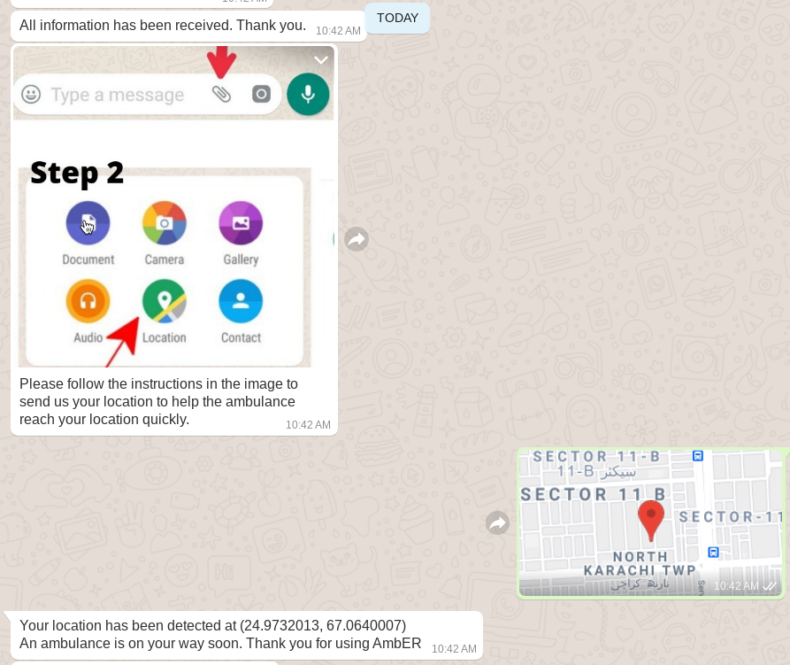

# AmbER-ignitors

## Inspiration

To this day, there remains no constructive, operative, and practical method that efficiently helps in emergencies to deliver time-critical patients to hospitals.

The access to ambulances and the reaching of ambulances on the location of patients has been time-consuming and stressful. Not only that, but also the process to register an ambulance can take approximately 10 to 20 minutes for a patient in critical need. This happens because the patient or the caretaker for the patient has to explain the route and provide details to the ambulance call center. These formalities often take a lot of time, which can be fatal for critical patients reaching the hospital on time.

## What does it do?

AmbER (Ambulance to ER ) acting exactly as its name suggests when it comes to registering an ambulance and making contact easier between ambulance service and the user. Where the whole process is automated, you don't have to worry about any external equipment as it is just available on your mobile phones. All you have to do is send a message in WhatsApp, provide the address using pin location and hospital name you need to go to, provide other necessary information for ambulance service to avoid all troubled feelings about getting an ambulance to your doorstep. From there onwards, AmbER captains have access to the AmbER app, helping them to reach you through the most optimal route. The process includes helping them in utilizing the best route from the pickup to the hospital making sure that critical emergencies can be catered in the most optimized time.  It is time-efficient, easy, and reliable.

## Innovation

As of right now, no such automated system exists which provides such service. Also, the integration of whatsapp and google maps with ambulance captain app in flutter can allow ambulances to reach user in least amount of time and also be aware of any extra conditions that may be needed for Pre-hospital care. Also after reaching the pickup point the ambulance captain can have access to multiple routes to reach hospital using our app which is integrated with Google Maps allowing them to be alerts open/closed roads, and road with high traffic.

## What Did We Use?

The hackathon prototype is split into two interfaces,

1. One for the user. This can be the patient themselves, or someone on behalf of the patient ( care taker ),
  1. This is based on WhatsApp, and uses Twilio as a service for inter communication
  2. It has textual instructions, as well as an audio clip for English / Urdu routes and an image on how to share your image via a pin
2. One for the AmbER driver. A kind of Uber which helps drivers find the most optimal route for the patient and the hospital they wish to visit
  1. This is based on Flutter and offers a Uber like experience for quick navigation
  2. To test out the demo, you can download the APK file [here](https://drive.google.com/file/d/1J0Ml9F7TPbtfGhwX_8VJtaX6w7YPkHLv/view)!
  3. To login in to the application, please use these credentials, Email: Spam11196@gmail.com, Password: shahmeer
3. Both the applications will communicate with each other to update the driver and user of the information they need. For example, AmbER on WhatsApp hands out a form to the care taker / patient to fill out information that would be needed by the hospital and the driver, and this gets forwarded to both. The user has the option to get updates of the driver by returning the driver's phone number.

### Images For Twilio + WhatsApp




<h1> NOTE <h1>
1. Please make sure you run flutterapp and whatsapp on different phones to avoid any issues as it should work that way
2. The flutter app we have shared in drive link has a starting issue. After installing, exit the installer screen and click icon to open the app

### Instructions For Using The WhatsApp Demo

Send a WhatsApp message to +1 415 523 8886 with code join wrote-rhyme!
Please make sure to follow the format. Here is a sample you can copy paste to check out the demo.
```
Care Taker Name: Saif;
Care Taker CNIC: 12345;
Patient Name: Saif;
Age: 21;
Hospital: Aga Khan;
Patient Condition: Stable;
Reason For Transport: Heart;
Special Needs: None;
Pre Existing Conditions: None;
```

You can choose either from 'English', or 'Urdu'. There is also a Voice Note for instructions if you prefer that.

Below attached is also an image of the complete intended flow,


### Images, Flutter for AmbER Driver Service


## Challenges We Ran Into

## Estimating The Impact 

In Pakistan, the ambulance service systems are quite unreliable. The number of hospitals in Pakistan is limited. Also, the process of calling an ambulance and registering and contacting the ambulance driver to help him to reach the location takes up a considerable amount of time. Using our solution we tend to reduce that time as much as possible and provide the ambulance captain's as much knowledge and information before reaching the pickup point to assist the user in this emergency and help in saving a person's life.

# The Social Aspect

It's not hard to find news or reports of ambulances complaining about people misusing their services. This can be spam, prank calls, or just over all behavior which wastes resources on all fronts. Blacklisting is something to consider for AmbER, but not yet implemented into the service as of right now.

## What's next for AmbER?

To make it more accessible for less privilidges population, AmbER needs to be integrated with SMS service using twilio and allowing them access to this amazing service helping people save lifes.
